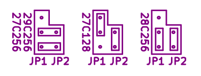

# Radio 86RK - ROM Cartridge
ROM cartridge for my [Radio-86RK](https://github.com/skiselev/radio-86rk) implementation

## Introduction
This ROM cartridge provides 16 KiB - 32 KiB ROM, that can be used to store the software - development tools, games, and so on.
The ROM cartridge connects to Radio-86RK using the 8255 PPI based parallel interface.

## Using ROM Cartridge

Make sure to power off the computer before connecting the cartridge. Connect the cartridge to the computer using a 26 conductor flat ribbon cable. 

The Radio-86RK ROM monitor provides [**R** command](https://github.com/skiselev/radio-86rk#monitor) that can be used to copy of the ROM cartridge to computer's RAM.
The syntax of **R** command is:
**R\<ROM_Start_Address\>,\<ROM_End_Address\>,\<Destination_Start_Address\>**

The ROM monitor also provides a subroutine to copy ROM cartridge content to the RAM:

* Entry point: 0FA68H
* Input registers:
  * HL - ROM start address
  * DE - ROM end address
  * BC - RAM start address

## Hardware Documentation

### Schematic and PCB Layout

[Schematic - Version 1.1](KiCad/radio-86rk-rom-Schematic-1.1.pdf)

[PCB Layout - Version 1.1](KiCad/radio-86rk-rom-Board-1.1.pdf)

### Connectors and Jumpers

#### J1 - Parallel Port Connector
Pin | Description | Pin | Description
--- | ----------- | --- | ----------------
1   | Output: A8  | 2   | Output: D0
3   | Output: A9  | 4   | Output: D1
5   | Output: A10 | 6   | Output: D2
7   | Output: A11 | 8   | Output: D3
9   | Output: A12 | 10  | Output: D4
11  | Output: A13 | 12  | Output: D5
13  | Output: A14 | 14  | Output: D6
15  | Output: /ROM_CE | 16  | Output: D7
17  | Output: A7 | 18  | Input: A0
19  | Output: A6 | 20  | Input: A1
21  | Output: A5 | 22  | Input: A2
23  | Output: A4 | 24  | Input: A3
25  | Power: +5V  | 26  | Power: GND

#### JP1 and JP2 - ROM Type Configuration

JP1 determines the connection of the ROM's pin 1, while JP2 determines the connection of the ROM's pin 27

ROM Type       | Jumper 1 Position      | Jumper 2 Position
-------------- | ---------------------- | ----------------------------
27C128         | JP1 - 2-3              | JP2 - 1-2 (jumper installed)
27C256, 29C256 | JP1 pin 1 to JP2 pin 1 | JP1 pin 2 to JP2 pin 2
28C256, NVRAM  | JP1 - 1-2              | JP2 - 1-2 (jumper installed)

### Bill of Materials

* [Radio-86RK-ROM project on Mouser.com](https://www.mouser.com/ProjectManager/ProjectDetail.aspx?AccessID=xxxxxxxxxx) - View and order all component except of the PCB.

* [Unicorn Electronics](https://www.unicornelectronics.com/prod.htm) is a good source for UV ERPROMs and EEPROMs

Component type     | Reference | Description                                 | Quantity | Possible sources and notes
------------------ | --------- | ------------------------------------------- | -------- | --------------------------
PCB                |           | Radio-86RK ROM Cartridge PCB - Version 1.1  | 1        | Buy from my Tindie store: [Radio-86RK - PCB](https://www.tindie.com/products/weird/radio-86rk-pcb/) or order from a PCB manufacturer of your choice using provided Gerber or KiCad files
Capacitor          | C1        | 0.1 uF, MLCC, 5 mm Pitch                    | 1        | Mouser [594-K104K15X7RF53H5](https://www.mouser.com/ProductDetail/594-K104K15X7RF53H5)
Connector          | J1        | 13x2 pin header, shrouded                   | 1        | Mouser [517-30326-6002](https://www.mouser.com/ProductDetail/517-30326-6002)
Connector          | JP1       | 3 pin header                                | 1        | Mouser [855-M20-9990345](https://www.mouser.com/ProductDetail/855-M20-9990345)
Connector          | JP2       | 2 pin header                                | 1        | Mouser [855-M20-9990245](https://www.mouser.com/ProductDetail/855-M20-9990245)
Integrated Circuit | U1        | 28C256, 27C256, 27C128                      | 1        | Unicorn Electronics [27C256, 27C128](https://www.unicornelectronics.com/IC/EPROM.html), [28C256](https://www.unicornelectronics.com/IC/EEPROM.html), Mouser [556-AT28C25615PU](https://www.mouser.com/ProductDetail/556-AT28C25615PU)
IC Socket          | U1        | 28 pin DIP                                  | 1        | Mouser [649-DILB28P223TLF](https://www.mouser.com/ProductDetail/649-DILB28P223TLF), [517-4828-6000-CP](https://www.mouser.com/ProductDetail/517-4828-6000-CP)
Connector          | Cable Assembly | 13x2 pin IDC socket                    | 2        | Mouser [517-D89126-0131HK](https://www.mouser.com/ProductDetail/517-D89126-0131HK)
Cable              | Cable Assembly | 26 conductor flat ribbon cable, 1 ft.  | 1        | Mouser [517-3365/26FT](https://www.mouser.com/ProductDetail/517-3365-26FT)

